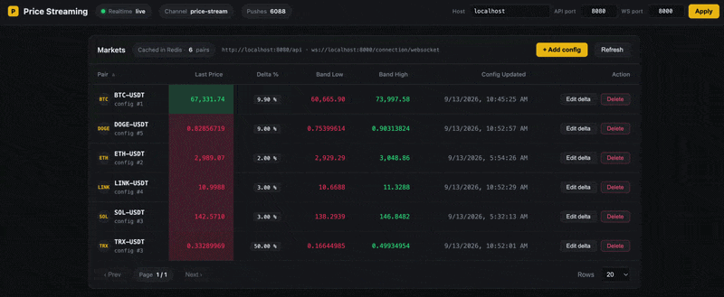
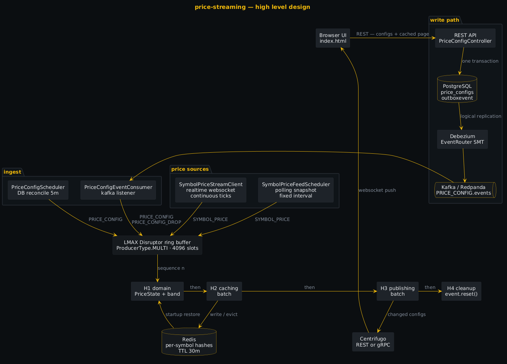
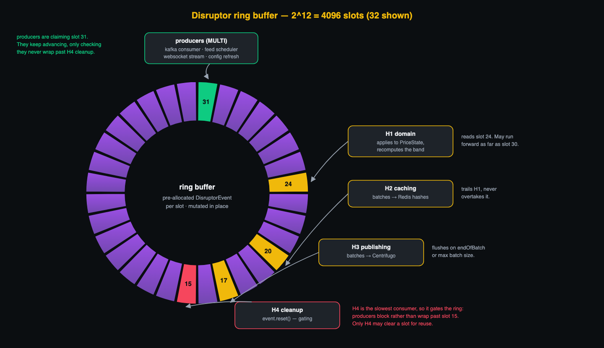

# price-streaming



## Stacks


## High level design



Writes land in PostgreSQL and the outbox table in one transaction. Debezium turns outbox rows into
Kafka events, the consumer feeds them into the ring buffer, and a single threaded domain handler owns
all mutable state.

Prices reach the ring from two independent sources:

| source | mode | class |
| --- | --- | --- |
| polling | fixed interval snapshot of every symbol | `SymbolPriceFeedScheduler` |
| streaming | continuous realtime ticks over a websocket | `SymbolPriceStreamClient` |

### Ring buffer



| Aspect | Value |
| --- | --- |
| Size | `1 << disruptor.ringBufferPowSize` = **4096** slots, power of two so a sequence maps to a slot by bit mask instead of modulo |
| Producer type | `ProducerType.MULTI` — kafka consumer, feed scheduler, websocket stream and config refresh all claim sequences concurrently |
| Wait strategy | `disruptor.waitStrategy` — `BLOCKING` by default; `YIELDING` / `BUSY_SPIN` trade CPU for latency, `TIMEOUT_BLOCKING` uses `disruptor.waitTimeout` |
| Allocation | every slot holds a `DisruptorEvent` built once at startup; producers copy values **into** the slot through `EventTranslatorOneArg`, so steady state allocates nothing |
| Ordering | `handleEventsWith(H1).then(H2).then(H3).then(H4)` is a dependency chain, so each event clears one stage before the next sees it |
| Batching | H2 and H3 accumulate into pre-allocated buffers and flush on `endOfBatch` or at `disruptor-handler.maxHandler{2,3}BatchSize` |
| Cleanup | H4 is the only stage calling `event.reset()`, so earlier stages still see a populated event |
| Back pressure | producers block once the ring is full; the gating sequence is the slowest consumer, so a stalled Redis or Centrifugo throttles ingestion instead of dropping events |
| Failure isolation | `DisruptorExceptionHandler` logs and continues, otherwise one bad event kills the consumer thread and stalls the ring |

State lives only in H1, which is single threaded by construction, so `PriceState` needs no locks.

Diagram sources: [`docs/high-level-design.puml`](./docs/high-level-design.puml) (PlantUML),
[`docs/ring-buffer.svg`](./docs/ring-buffer.svg) (SVG)

## Setup
```shell
docker compose up -d
```

```shell
curl -i -X POST http://localhost:8083/connectors \
  -H "Content-Type: application/json" \
  --data @etl/outbox-connector.json
```

```shell
export POSTGRES_USER=username
export POSTGRES_PASSWORD=password

./mvnw liquibase:status

./mvnw liquibase:update
```

Centrifuge .proto
```shell
https://github.com/centrifugal/centrifugo/blob/master/internal/apiproto/api.proto
```
